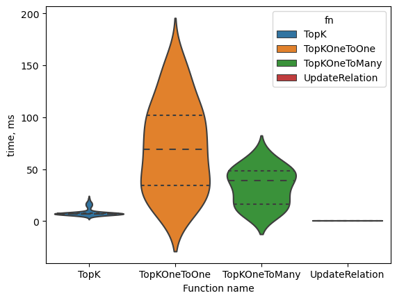
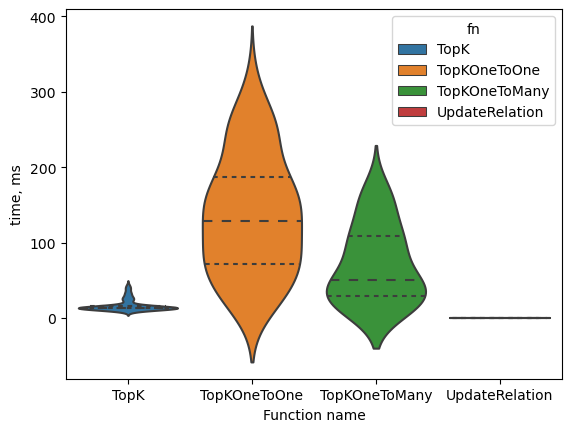

# kSPA - The k-Shortest Paths Algorithms Go package
---

## Base interface
---

All kSP-algorithms implements [Searcher](searcher.go) interface:

```go
	TopK(g *MultiGraph, srcId int, targetId int, topK int) (res PriorityQueue)
	TopKOneToOne(g *MultiGraph, srcIds []int, targetIds []int, topK int) (res []PriorityQueue)
	TopKOneToMany(g *MultiGraph, srcIds []int, targetIds []int, topK int) (res []PriorityQueue)
```

where 
- **g** - pointer to the directed cyclic graph (DCG) [MultiGraph](multi_graph.go),
- **srcId** - the start point Id of desired paths,
- **srcIds** - array of start points,
- **targetId** - the end point Id of desired paths,
- **targetIds** - array of end points,
- **topK** - desired count of paths.

**TopK** function return the [PriorityQueue](priority_queue.go) object with top k-paths from the single source to the single target, where *path's weight &#8594; min*.

**TopKOneToOne** function return the [PriorityQueue](priority_queue.go) object with top k-paths for every pair *single source &#8594; single target* stored in corresponding positions of arrays *srcIds* and *targetIds*.

**TopKOneToMany** function return the [PriorityQueue](priority_queue.go) object with top k-paths for every pair *single source &#8594; any target* stored in i-th position of array *srcIds* and every position of *targetIds*.

All subroutines exposed above exploit [MultiGraph](multi_graph.go) object as storage of Directed cyclic Graph.  

## Directed Cyclic Graph
---

[MultiGraph](multi_graph.go) object supports several operations with DCG
```go
func (g *MultiGraph) Build(ent EntitySeq)
func (g *MultiGraph) Pred(v int) MEdgeSeq
func (g *MultiGraph) Succ(u int) MEdgeSeq
func (g *MultiGraph) UpdateRelation(ent EntitySeq) error
func (g *MultiGraph) GetEdgeIndex(id1, id2 int) (int, bool)
```
where
- **Build** - builds DCG from the [Entities](entity.go) array,
- **Pred** - returns all predecessors of the vertex with internal id *v*,
- **Succ** - returns all successors of the vertex with internal id *u*,
- **UpdateRelation** - update DCG from the [Entities](entity.go) array; returns Error object if *ent* array consists new edges,
- **GetEdgeIndex** - returns internal index of [MultiEdge](multi_edge.go),
- **id1, id2** - Ids of verteces from [Entity](entity.go) object,
- **ent** - [EntitySeq](entity.go) array of Entity-objects.

---
**NOTE**

For getting the internal ids of vertex use g.VertexIndex map of [MultiGraph](multi_graph.go).

---

## Input data
---

Package provide subroutines for export/import entities from Json files:

```go
func FromJsonFile(fn string) (seq EntitySeq)
func ToJsonFile(fn string, seq EntitySeq)
```
The entity object must have the structure exposed below 

```go
type EntityRaw struct {
	EntityId string `json:"EntityId"`
	Id1      int    `json:"Id1"`
	Id2      int    `json:"Id2"`
	Relation string `json:"Relation"`
}
```
where 
- **EntityId** - unique id of the edge,
- **Id1, Id2** - not unique ids of verteces,
- **Relation** - value of Entity cost

## Operations with DCG
---

1. Reading and building graph from JSON file:
```go
	basePath := "./examples"

	graph := new(MultiGraph)
    entities := FromJsonFile(path.Join(basePath, "small.json"))
	graph.Build(entities)
```
2. Getting internal edge index
```go 
    entity := Entity{Id1: 1, Id2: 2}
    index, getIndexOk := graph.GetEdgeIndex(entity.Id1, entity.Id2)
```
3. Getting predecessors and successors of vertex
```go 
    entity := Entity{Id1: 1, Id2: 2}
    u := graph.VertexIndex[entity.Id1]
    v := graph.VertexIndex[entity.Id2]
    s := graph.Succ(u)
    p := graph.Pred(v)
```
4. Updating edges costs
```go
    updates := FromJsonFile(path.Join(basePath, "small_update.json"))
    err := graph.UpdateRelation(updates)

    if err != nil {
        panic(fmt.Errorf("UpdateRelation() error = %v", err))
    }
```
More examples of using DCG object see [here](multi_graph_test.go).

## Algorithms
---

The package includes several algothims:

1. Depth-First Search with Memoization | [source](dfs_memo.go)
2. [Recursive Depth-First Search](http://web.cs.unlv.edu/larmore/Courses/CSC477/bfsDfs.pdf) | [source](dfs_colored.go)
3. [Iterative Depth-First Search](http://web.cs.unlv.edu/larmore/Courses/CSC477/bfsDfs.pdf) | [source](dfs_stacked.go)
4. [Floyd-Warshall](https://en.wikipedia.org/wiki/Floyd%E2%80%93Warshall_algorithm) | [source](floyd_warshall.go)
5. [Bellman-Ford](https://en.wikipedia.org/wiki/Bellman%E2%80%93Ford_algorithm) | [source](bellman_ford.go)

---
**NOTE**

The algorithms 2-5 don't implemented completely. It is part of experimental interfaces of package. Please be careful with using it.

---

## Depth-First Search with Memoization
---

This is a variant of [ID-DFS](https://en.wikipedia.org/wiki/Iterative_deepening_depth-first_search) algorithm. Current implementation have several modification and differences from the original algorithm:
- depth of searching limited by concrete value instead of positive infinity in the original algorithm,
- using memoization,
- reducing multiple edges with the same source and target to *optimal* edge with least value of weights,
- weights calculates as **- math.log(entity.Relation)**,
- using weight boundaries and PriorityQueue.

Algorithm includes the next steps:
1. Reduce multiple edges with the same source and target to *optimal* edge with least value of weights calculates as *- math.log(entity.Relation)*.
2. Build Depth-First Search Tree using dfs+memoization+limiting depth by optimal value:
```
    DFS(source, target, level) returns nodes, stat:
        if inMemo(source, target, level):
            return getMemo(source, target, level)

        stat = {min, max, mean, mean2, pathsCount}
        nodes = array of TreeNode

        for edge as (u,v) in successors(succ):
            if target == v:
                appendTo(nodes, NewTreeNode(edge, "endpoint"))
                calcStatistics(stat, edge)
                continue

            appendTo(nodes, 
                ExpandTreeNodes(edge,DFS(v, target, level+1)))
            calcStatistics(stat, edge)

        setMemo(source, target, level, nodes, stat)
        return nodes, stat
```
For every TreeNode weight x MIN(x), MAX(x), E(x) and E(x**2) statistics processed and stored. This statistics used for skip not optimal branches for reducing searching area.  

3. Calculate *threshold* depended by preinitialized *mode* which reduce Time Complexity of algorithm:
```go
    stat = getMemo(source, target, level) // E(x), E(x**2), pathsCount
	switch mode {
	case THR_ZERO:
		threshold = 0
	case THR_MEAN:
		threshold = E(x)
	case THR_MEAN_STDDEV:
		threshold = E(x) - sqrt((E(x**2)-E(x) ** 2)/pathsCount)
	}
```
Also user can set the custom value of *threhold*.

4. Trace *memo* object using original dfs algorithm with constraints:
```
pq = priority queue

TRACE(src int, target int, level int):
	if src < 0 or target < 0 or level < 0:
        return

	nodes, stat = getMemo(source, target, level)

	if psa[level]+stat.minWeight >= threshold:
		return

	if maxWeight != MIN_WEIGHT and
        psa[level]+stat.minWeight > maxWeight:
		return

	for node in nodes:
		edges[level] = node.base
		weight = psa[level] + node.base.weight
		psa[level+1] = weight

		if node.src < 0:
			if weight >= 0:
				continue

			if weight < maxWeight:
				set(pq, edges, weight)
				maxWeight = pq[0].priority

			continue
		}

		TRACE(node.src, node.target, node.level)
```
5. Process multiple edges with the same source and target for every *optimal* edge from *pq*. This step is true because every path included not *optimal* edge is worse or equal than the path included only *optimal* edges. For more information see [ProcessOutsideEdges](utils.go).

## Launch Depth-First Search methods
---

Some [Factory interfaces](searcher_factory.go) provided by package for creating Searcher-compatible objects:
```go
func NewDfs(name string, deepLimit int) (Searcher, error)
func DfsDo(st Searcher, op string, g *MultiGraph, srcIds []int, targetIds []int, topK int) (pathsb []byte, err error)
func NewSearcher(major string, minor string) (Searcher, error)
```
where
- **major** - the algorithm's family, e.g. "dfs",
- **minor**, **name** - particular algorithm, e.g. "colored", "stacked", "memo",
- **deepLimit** - depth of searching limited by this value,
- **op** - one of the "TopK", "TopKOneToOne", "TopKOneToMany".

## Benchmarks
---
Benchmarks above were made for the Depth-First Search with Memoization algorithm with deepLimit=[5, 6]. For details see [this](dfs_memo_test.go).

---
**NOTE**

- All values in tables exposed in milliseconds.
- Testing environment - os: linux, arch: amd64, cpu: Intel(R) Core(TM) i7-8750H CPU @ 2.20GHz.
- Test data was generated by [GenerateRandomEntitiesJson](entity.go) subroutine.
- q25, q50, q75 - are corresponding percentiles 25%, 50%, 75%.

---

### Table 1 - Depth-First Search with Memoization with deepLimit=5
#|fn|mean|min|max|q25|q50|q75
:--|:--|:--|:--|:--|:--|:--|:--|
0|TopK|8.4|4.3|22|6.8|7.1|7.5
1|TopKOneToMany|33|6.0|64|17|39|48
2|TopKOneToOne|71|6.9|160|35|69|100
3|UpdateRelation|< 1 ns|< 1 ns|< 1 ns|< 1 ns|< 1 ns|< 1 ns



### Table 2 - Depth-First Search with Memoization with deepLimit=6
#|fn|mean|min|max|q25|q50|q75
:--|:--|:--|:--|:--|:--|:--|:--|
0|TopK|17|8.9|44|13|14|15
1|TopKOneToMany|71|13|180|29|51|110
2|TopKOneToOne|140|80|320|72|130|190
3|UpdateRelation|< 1 ns|< 1 ns|< 1 ns|< 1 ns|< 1 ns|< 1 ns




## Analysis
---

With the depth equal 5 and top-100 paths all subroutines working time less than 160ms. Maximum working time was detected for *TopKOneToOne* subroutine for the 15th length input array *srcIds*. 

With the depth equal 6 and top-100 paths all subroutines working time less than 320ms. Maximum working time was detected for *TopKOneToOne* subroutine for the 15th length input array *srcIds*. But for 10th length input array *srcIds* maximum working time is about 200ms.

With both depth values (5 and 6) the subroutine *UpdateRelation* working time less than 1 ns for updating 20000 edges in graph structure. It is possible due to the internal index maps inside the DCG and MultiEdge objects.

With depths equal or greater 5 paths with internal loops may exist, e.g. [chain](examples/pools_10_8_10o.json) with length eq 8:
```
entity-7023 -> entity-1305-b -> entity-291-b -> entity-1992-b -> entity-6958 -> entity-1305-b -> entity-291-b -> entity-18-b 
```
has negative internal loop from vertex with id 15 to the same vertex:
```
entity-1305-b -> entity-291-b -> entity-1992-b -> entity-6958
```

This path is the best with the maximum relation value and the *Depth-First Search with Memoization* algorithm allows to find it. 

Compare results from [this](./examples/pools_100_5_10o_col.json) and [that](./examples/pools_100_5_10o.json) its obvious that the *Depth-First Search with Memoization* algorithm allows to find more paths with greater cost than the Recursive and Iterative classic Depth-First Search algorithms with skipping visited verteces. 

## Conclusion
---

- Using Depth-First Search algorithm with Memoization appropriate for systems with the rigorous time constraints (e.g. > 5000 verteces and > 20000 edges).
- For best performance find compromises between depth and size of top-k sequence (e.g. for depth=8 use top-10 sequence, for depth=5 use top-100 sequence, for depth=6 use top-50 or less sequence).
- For dense graph performance of the package subroutines may be worse.
- Choose the *threshold* parameter or algorithm for it processing according to density of *Relation* parameter.
- *Depth-First Search with Memoization* algorithm allows to find more paths with greater cost than the Recursive and Iterative classic Depth-First Search algorithms with skipping visited verteces.
- Algorithms such Bellman-Ford and Floyd-Warshall not appropriate for DCG with large count of vertices and edges due to low performance (more than several seconds for full paths task). Besides Bellman-Ford and Floyd-Warshall algorithms don't correct working with nested negative cycles.


